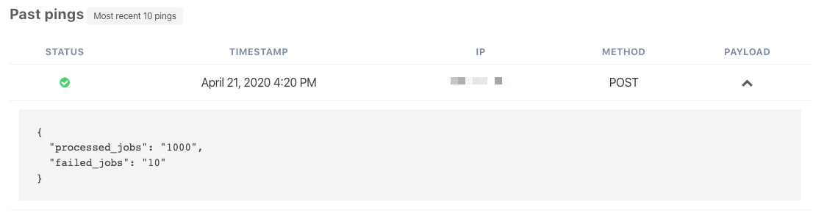

# Sending Data

Often your cron job outputs some data or logs, and you need to see it. Of course, ssh-ing to your server and echo-ing the output file every single time takes a lot of time. To solve this problem, you can now send your cron job output to Cronhub when you ping your monitor.

If you ping your Cronhub monitor with a GET request, then you can use URL param to pass a simple string.

```
https://cronhub.io/ping/94160de0-83f8-11ea-8723-d3afea01e5aa?payload=processing_jobs,30
```

Please note that for GET requests, the URL param must be `payload.`

If you need to send a JSON payload, then you can use a POST request for that. Attach your payload as a POST data, and we will store it on our end. Something like this will work.

```sh
curl -d '{"processed_jobs":"1000", "failed_jobs":"10"}' \
https://cronhub.io/ping/654be180-83f8-11ea-8aa6-1f735e295b19

```

After the ping, we will display the payload on your monitor overview page under "Past pings" sections as follows.




The limit of the data you can send is 1000 characters.
